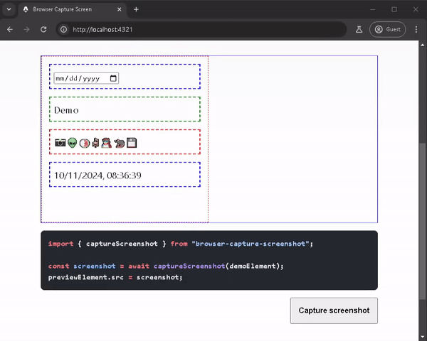

# Browser Capture Screenshot

Browser Capture Screen utilises browser’s [getDisplayMedia](https://developer.mozilla.org/en-US/docs/Web/API/MediaDevices/getDisplayMedia) API to capture screenshot from the page.

```bash
npm install browser-capture-screenshot
```

## Demo
See demo at [https://amoshydra.github.io/browser-capture-screenshot](https://amoshydra.github.io/browser-capture-screenshot)



## Usage

```ts
import { captureScreenshot } from "browser-capture-screenshot";

const screenshot = await captureScreenshot(demoElement);
previewElement.src = screenshot;
```
